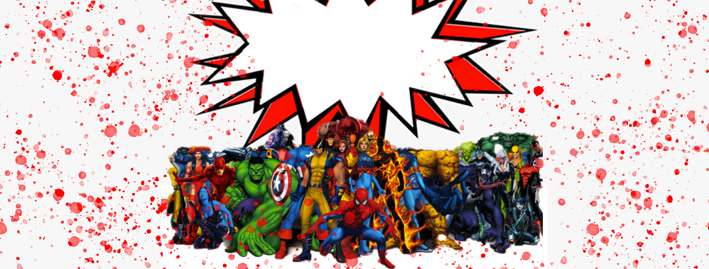
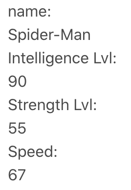
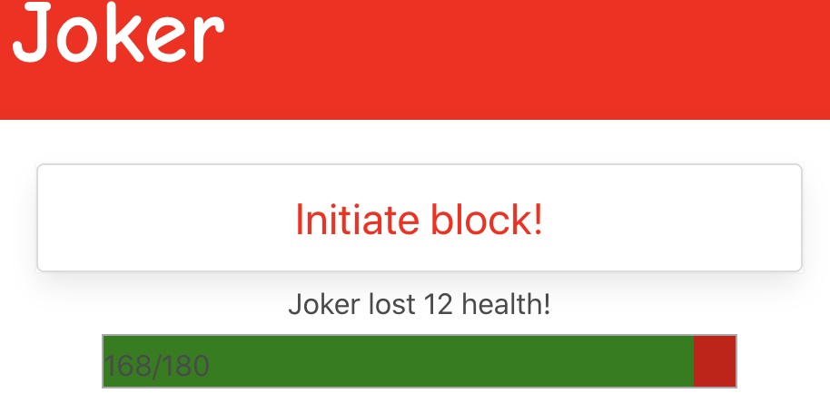
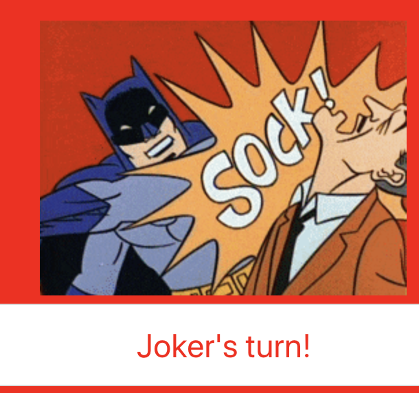
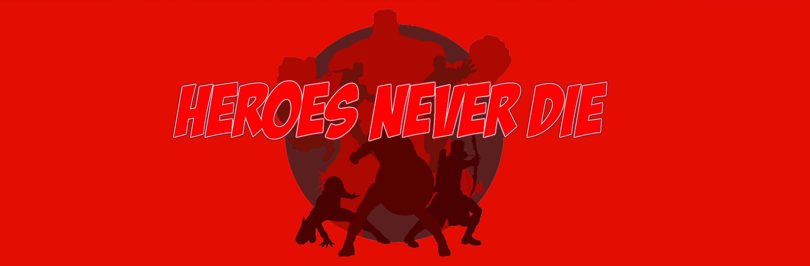

# Character Combat

Challenge heroes and villains in the ultimate combat showdown!

___

## Description

Character combat is a game that is designed to give the user the unique experience of battling any type of superhero or villain. Our game allows for users to choose any of these three character combos: hero vs. hero, hero vs. villain, or villain vs. villain. The character library spans over 700 characters from D.C., Marvel, and everything in between allowing for countless battles with varying results creating a user experience that is ever changing.

___

## How It Works

In order to format the gameplay correctly, we needed several HTML pages, all formatted differently. To start, we decided on a theme. For this game, we went with a classic comic book theme to represent the general gameplay, and then created individual themes for both a superhero and villain victory. The first page created through the HTML was the index.

Within the index HTML page, the first step was to create a logo for our game that would display at the top of the page. Using Adobe PhotoShop, Brittany created a logo of superheros with custom font and animation for the logo. That was embedded into the page using an image tag, and then the width was customized to 100% in the CSS file so that it would be dynamic on the page on any screen resolution. 

Following the creation of the header, the rest of the layout was created. Brittany used a CSS Framework (Bulma) to add individual spaces to hold the search bar for each character, a statistics page to hold their information, and a battle button to bring you to the second HTML page. Statistics for each player and the battle button were given a class of “none” to hide them until you search for a character. The background of the page was created using images within the HTML (“Player One,” “Player Two,” “VS”) and CSS elements to set the background color and color of button text.

Chris's portion of the project worked closely with the framework that was established by Brittany.  He was in charge of managing the content that would be implemented onto the main HTML page. Because the project is a fight simulator between heroes and villains, the home page's main function is a means of gathering information about the selected character and then storing the data locally to the user's device. The information to be displayed as the character statistics was gathered from the Superherodb.com API. Using CSS & jQuery, Chris was able to manipulate the DOM and create specific elements to have the images of the characters and their stats appear and disappear as needed.

When the index page was successfully styled, the next HTML page that was created was the combat page, which held all of the actual gameplay. Again, the layout had to be repeated to match the previous page. Brittany embedded the logo again at the top of the page, and then created two cards that would hold the health bar and photos of each character being played. Then an action button was placed in between these two cards in order to start the game play. Again, images were appended to represent each character (“Player One,” “Player Two”). 

The creation of the HTML and CSS pages allowed for Alex to move forward and create the Javascript necessary for the gameplay. The game consists of two heros that compete back and forth in rounds. For each round, the user will press a button to start a character's turn. Health will either be immediately taken from the hero’s green health bar, or it will prompt the user to have the character activate a special move, have its opponent block the attack, or both. When a hero runs out of health, the game is over and that character loses. 

The battle outcome depends on 6 different attributes: speed, intelligence, power, strength, durability, and combat. Each attribute has a score from 1-100 per hero/villain.

Usage of attributes are split into different categories: Defensive and Offensive.

### Defensive:

Health - This is the amount of health a character has and is based on characters durability:  
150 + .5 * character's durability = health  
    Ex 1:100 durability = 200 health  
    Ex 2: 10 durability = 155 health  

Block ability - This is the character's ability to block an attack. When a character blocks, he takes half the normal damage. This is based on speed. Block will occur when a random number (between 1 and 100) falls between 50 and an upper number. The upper number is 80 plus 20% the speed of the hero minus 10% the speed of his/her opponent.  

80 + .2 *speed of hero - .1 * speed of opponent

This makes it so that slow characters have a lesser chance of blocking fast opponents, but have a higher chance of blocking slower opponents. Faster characters also have a lower chance of blocking a faster opponent than a slower one.  
Ex 1: hero has 10 speed, opponent has 100. Hero has 22% chance of blocking 
Ex 2: hero has 100 speed, opponent has 10. Hero has 49% chance of blocking  
Ex 3: both characters have 100 speed. Both have 40% chance of blocking  
Ex 4: both characters have 10 speed. Both have a 31% chance of blocking.  

### Offensive:

Damage ability - This is how much damage a character can deal to its opponent. It is the character's top (maximum) hit power and is based on strength and power.  

.07 * (hero durability  + strength) + 10 = top hit power  

Ex 80 strength and 50 power would give a hit power of 19.1 
Hit power set likelihood (Not every hit lands as well as another) 
Base likelihood = top hit power minus a random number from 1 to 8 
Ex: hero with top hit power of 20 can lay a hit between 12 and 20

Likelihood is also based on intelligence and combat ability:  
If intelligence and combat ability > 180 then hit variance is from 1 to 5 
If 180 =>intelligence and combat ability > 150 then hit power variance is from 1 to 6 
If 150 => intelligence and combat ability > 120 then hit power variance is from 1 to 7 
If 120 =>intelligence and combat ability then hit power variance remains 1 to 8  

Ex: Character with top hit power of 20 and a combined intelligence and combat ability of 185 can lay a hit between 15 and 20 power.  
Special move - When activated, this inflicts extra damage to the opponent.

The normal hit power plus 10% of the combat number:

hit power + .1 * combat move

Ex: The normal hit for the round is 20 and the hero has a combat number of 60. When a combat move is activated, the new combat hit is 26.

Special move likelihood is a random number is chosen from 1 and 100. If it is between 10 and another number, the special move will be activated. The second number is 20 plus 30% of the characters intelligence rating.

Ex: An intelligence rating of 80 gives a character a 44% chance of having a special move per round.

Once the HTML and fight mechanics javascript pages were created, Chelsey used giphy.com to create a second API call for this project.  The use of this API allows for GIFs to show that changes on the page in relation to "Next Move" button. When the user presses the  button to begin their turn, a random GIF is shown that mimics a fight scene or popular onomatopoeia. That particular GIF will animate until the Next Move button is selected again. Once selected, this will then pull another GIF from the same genre to display on the screen. The GIFs are brought to the page using the ajax function that uses the query URL and a selected category, (in this case, Chelsey selected the "pow" class), to produce the selection of images. The use of the Math.Random function allowed for a random selection of images to display on the screen. The final step was to create an image tag and updating the CSS file to properly showcase the image between the two character cards.

 

After the first two pages were completed, Brittany created two new HTML pages and another CSS stylesheet. Each HTML page represented a victory for either a hero or a villain. The villain page included a dark theme. The header was again created in PhotoShop, and then videos were embedded in the page to create theme music for whichever alignment (hero or villain) was the victor of the game. The image of the winner was appended to the page from local storage, and that ended the game.

If the user would like to try again, they would just need to click the button to go back to index.html and begin the game again!
___

## Technologies

- HTML
- CSS
- BULMA
- JQuery
- Javascript
- Adobe PhotoShop
- Visual Studio Code
- API (Superhero & Giphy)

___

## Link To Project

https://ccraig7321.github.io/Character-Combat/
___

### License

Copyright 2020 CHELSEY CRAIG

Permission is hereby granted, free of charge, to any person obtaining a copy of this software and associated documentation files (the "Software"), to deal in the Software without restriction, including without limitation the rights to use, copy, modify, merge, publish, distribute, sublicense, and/or sell copies of the Software, and to permit persons to whom the Software is furnished to do so, subject to the following conditions:

The above copyright notice and this permission notice shall be included in all copies or substantial portions of the Software.

THE SOFTWARE IS PROVIDED "AS IS", WITHOUT WARRANTY OF ANY KIND, EXPRESS OR IMPLIED, INCLUDING BUT NOT LIMITED TO THE WARRANTIES OF MERCHANTABILITY, FITNESS FOR A PARTICULAR PURPOSE AND NONINFRINGEMENT. IN NO EVENT SHALL THE AUTHORS OR COPYRIGHT HOLDERS BE LIABLE FOR ANY CLAIM, DAMAGES OR OTHER LIABILITY, WHETHER IN AN ACTION OF CONTRACT, TORT OR OTHERWISE, ARISING FROM, OUT OF OR IN CONNECTION WITH THE SOFTWARE OR THE USE OR OTHER DEALINGS IN THE SOFTWARE.